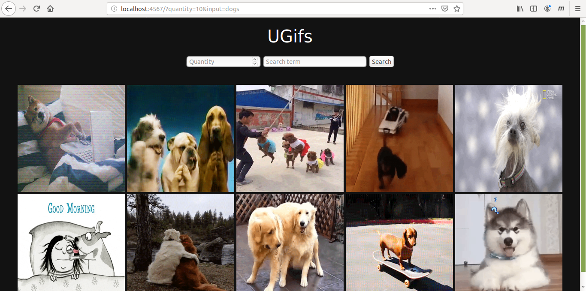

# UGifs

Application to find gifs using the [Giphy API](https://developers.giphy.com/).

## Screenshot



## Dependencies

[Sinatra](http://sinatrarb.com/) Framework was used to build this app.

Run this command to install the required gems:

```
$ bundle install
```

## Configuration

Open the `config.json` file and enter your Giphy API Key:

```json
{
    "api_key": "YOUR_GIPHY_API_KEY"
}
```

## Usage

Command to run the server:

```
$ ruby ugifs.rb
```

To see the application, open a browser window and navigate to http://localhost:4567.

## LICENSE

This project is licensed under [MIT License](LICENSE).
